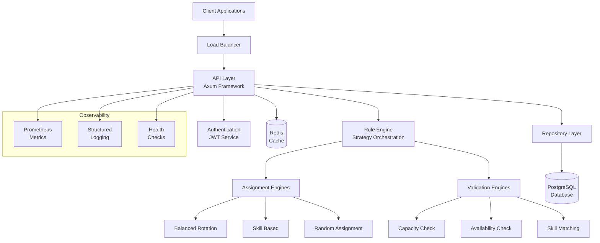
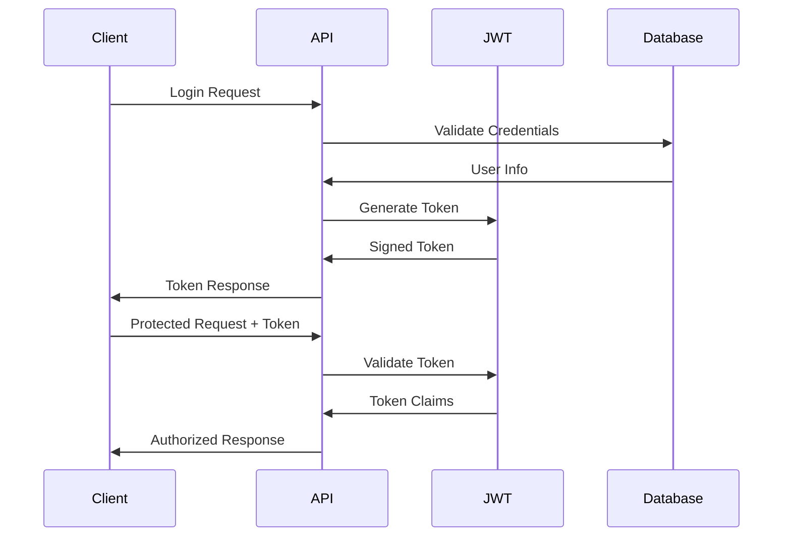
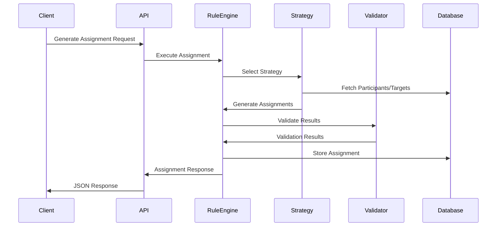
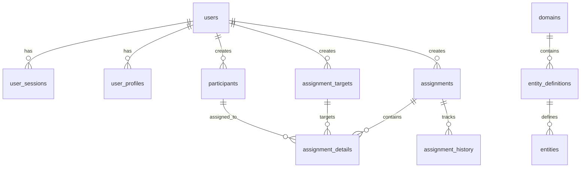
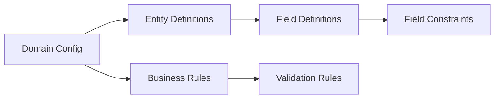

# VividShift Architecture

## Overview
This document provides a comprehensive overview of VividShift's system architecture, components, and design decisions.

**Target Audience:** Developers, architects, technical decision makers

## System Architecture



## Architectural Style
**Modular Monolith** with clear separation of concerns:
- **Layered Architecture**: API → Services → Database
- **Plugin-based Engines**: Pluggable assignment and validation strategies
- **Domain-Driven Design**: Configurable domain models and business rules

## Core Components

### API Layer
**Responsibility:** HTTP request handling, routing, validation, response formatting

**Key Features:**
- RESTful API design with Axum framework
- JWT-based authentication middleware
- Request/response validation using `validator` crate
- Standardized error handling and responses
- Health check and readiness endpoints
- CORS configuration for cross-origin requests

**Files:** `src/api/`

**Component Structure:**
```rust
pub struct AppState {
    pub config: Arc<AppConfig>,
    pub auth_state: AuthState,
    pub entity_manager: Arc<EntityManager>,
    pub rule_engine: Arc<RuleEngine>,
}
```

### Authentication System
**Responsibility:** User authentication, session management, authorization



**Key Features:**
- JWT token generation and validation
- Role-based access control (Admin, User, Viewer)
- Session tracking with database persistence
- Password hashing with bcrypt (configurable cost)
- Token expiration and revocation support

**Files:** `src/auth/`

### Rule Engine
**Responsibility:** Assignment strategy orchestration and business rule execution



**Key Features:**
- Pluggable assignment strategies
- Configurable validation pipeline
- Parallel processing support with configurable limits
- Strategy parameter validation
- Execution context tracking

**Files:** `src/services/rule_engine.rs`, `src/engines/`

### Assignment Engines
**Responsibility:** Implement specific assignment algorithms

**Available Strategies:**

1. **Balanced Rotation Strategy**
   - Distributes assignments evenly considering history
   - Configurable rotation and balance weights
   - Tracks participant assignment frequency

2. **Skill-Based Strategy**
   - Matches participants to targets based on required skills
   - Skill compatibility scoring
   - Fallback to capacity-based assignment

3. **Random Assignment Strategy**
   - Random distribution with capacity constraints
   - Configurable randomization seed
   - Ensures minimum capacity requirements

**Extension Pattern:**
```rust
#[async_trait]
impl AssignmentStrategy for CustomStrategy {
    async fn execute(
        &self, 
        participants: &[GenericEntity], 
        targets: &[GenericEntity], 
        config: &StrategyConfig
    ) -> Result<Vec<Assignment>> {
        // Custom assignment logic
    }
    
    fn name(&self) -> &str { "custom_strategy" }
    fn description(&self) -> &str { "Custom assignment algorithm" }
    fn validate_config(&self, config: &StrategyConfig) -> Result<()> { Ok(()) }
}
```

### Validation Engines
**Responsibility:** Validate assignment results against business rules

**Available Validators:**

1. **Capacity Check Validator**
   - Ensures targets have sufficient participants
   - Validates minimum and maximum capacity constraints
   - Configurable tolerance levels

2. **Availability Check Validator**
   - Verifies participant availability
   - Time-based availability validation
   - Conflict detection

3. **Skill Matching Validator**
   - Validates skill requirements are met
   - Configurable skill matching thresholds
   - Missing skill reporting

### Database Layer
**Responsibility:** Data persistence, query optimization, transaction management

**Architecture Pattern:** Repository Pattern with SQLx



**Key Features:**
- PostgreSQL with JSONB support for flexible schemas
- Connection pooling with configurable limits
- Migration system with rollback support
- Comprehensive indexing strategy (B-tree and GIN)
- Automatic timestamp management with triggers
- UUID primary keys for distributed compatibility

**Files:** `src/database/`

## Data Flow

### Assignment Generation Flow
1. **Request Validation:** API validates request format and authentication
2. **Strategy Selection:** Rule engine selects appropriate assignment strategy
3. **Data Retrieval:** Repository layer fetches participants and targets from database
4. **Assignment Generation:** Selected strategy generates participant-target assignments
5. **Validation Pipeline:** Multiple validators check assignment validity
6. **Persistence:** Valid assignments stored in database with audit trail
7. **Response Generation:** API returns formatted assignment results

### Configuration Flow
1. **Hierarchical Loading:** 
   - `config/default.toml` (base configuration)
   - `config/{environment}.toml` (environment overrides)
   - Environment variables (`VIVIDSHIFT_*` prefix)
   - `config/local.toml` (local development overrides)
2. **Validation:** Configuration validation at application startup
3. **Runtime Access:** Shared configuration state across all components

### Domain Configuration Flow


## Design Decisions

### Why Rust?
- **Performance:** Zero-cost abstractions and memory safety without garbage collection
- **Concurrency:** Excellent async/await support with Tokio runtime
- **Type Safety:** Compile-time guarantees reduce runtime errors significantly
- **Ecosystem:** Rich ecosystem with SQLx, Axum, and other production-ready crates
- **Memory Safety:** Prevents common security vulnerabilities like buffer overflows

### Why PostgreSQL?
- **JSONB Support:** Flexible schema for domain-agnostic entities and metadata
- **ACID Compliance:** Strong consistency guarantees for critical assignment data
- **Performance:** Excellent query optimization and comprehensive indexing support
- **Ecosystem:** Mature tooling, monitoring solutions, and operational knowledge
- **Scalability:** Proven scalability with read replicas and connection pooling

### Why Repository Pattern?
- **Testability:** Easy to mock repository interfaces for comprehensive unit testing
- **Abstraction:** Clean separation between business logic and data access concerns
- **Maintainability:** Centralized database operations with consistent error handling
- **Type Safety:** Compile-time query validation with SQLx prevents SQL injection
- **Performance:** Connection pooling and query optimization at the repository level

### Why Axum Framework?
- **Performance:** Built on Tokio and Hyper for high-performance async HTTP
- **Type Safety:** Strong typing for request/response handling
- **Middleware:** Composable middleware system for cross-cutting concerns
- **Ecosystem:** Excellent integration with Rust async ecosystem
- **Maintainability:** Clear separation of routing, handlers, and middleware

## Scalability Considerations

### Horizontal Scaling
- **Stateless Design:** No server-side session state enables easy horizontal scaling
- **Connection Pooling:** Efficient database connection management per instance
- **Load Balancer Ready:** Standard HTTP API suitable for any load balancing solution
- **Shared State:** Database and Redis provide shared state across instances

### Database Scaling
- **Read Replicas:** Repository pattern supports read/write splitting for query scaling
- **Connection Pooling:** Configurable pool sizes optimize database connections
- **Indexing Strategy:** Comprehensive indexing optimized for common query patterns
- **JSONB Performance:** GIN indexes enable efficient flexible schema queries

### Performance Characteristics
- **Response Time:** Sub-100ms for typical assignment generation requests
- **Throughput:** 1000+ requests/second on standard hardware (4 CPU, 8GB RAM)
- **Memory Usage:** ~50MB base memory footprint, scales with connection pool size
- **Database Connections:** Configurable pool (default: 10 max, 1 min connections)
- **Concurrent Processing:** Tokio async runtime handles thousands of concurrent connections

## Security Architecture

### Security Layers
1. **Input Validation:** Request payload validation using `validator` crate
2. **Authentication:** JWT token validation with configurable expiration
3. **Authorization:** Role-based access control with fine-grained permissions
4. **Database Security:** Parameterized queries prevent SQL injection
5. **Connection Security:** SSL/TLS support for database and Redis connections
6. **Session Management:** Token expiration, revocation, and secure storage

### Authentication Flow
- **Registration:** Password hashing with bcrypt (configurable cost factor)
- **Login:** Credential validation and JWT token generation
- **Authorization:** Middleware validates tokens on protected endpoints
- **Session Tracking:** Database persistence for audit and revocation support

### Data Protection
- **Sensitive Data:** Password hashing, token encryption
- **Audit Trails:** Complete change tracking with user attribution
- **Soft Deletes:** Data preservation with `is_active` flags
- **Input Sanitization:** Request validation prevents malicious input

## Observability

### Logging
- **Structured Logging:** JSON-formatted logs with contextual information
- **Log Levels:** Configurable levels (debug, info, warn, error)
- **Request Tracing:** HTTP request/response logging with correlation IDs
- **Database Logging:** Query performance and connection pool metrics

### Metrics
- **Application Metrics:** Request counts, response times, error rates
- **Database Metrics:** Connection pool usage, query performance
- **Business Metrics:** Assignment generation success rates, strategy usage
- **System Metrics:** Memory usage, CPU utilization, garbage collection

### Health Checks
- **Liveness:** Application health endpoint for orchestration
- **Readiness:** Database and dependency health validation
- **Deep Health:** Comprehensive system component validation

## Module Organization

```
src/
├── api/                    # HTTP API endpoints and routing
│   ├── auth.rs            # Authentication endpoints
│   ├── health.rs          # Health check endpoints
│   ├── work_groups.rs     # Business logic endpoints
│   └── mod.rs             # API router configuration
├── auth/                  # Authentication and authorization
│   ├── jwt.rs             # JWT token management
│   ├── middleware.rs      # Authentication middleware
│   ├── models.rs          # Authentication data models
│   └── mod.rs
├── database/              # Data persistence layer
│   ├── repositories/      # Repository pattern implementation
│   ├── connection.rs      # Database connection management
│   ├── migrations.rs      # Schema migration management
│   ├── models.rs          # Database models and types
│   ├── json_migration.rs  # JSON data import system
│   ├── seeding.rs         # Development data seeding
│   └── observability.rs   # Database monitoring
├── engines/               # Business logic engines
│   ├── assignment/        # Assignment strategy implementations
│   ├── validation/        # Validation rule implementations
│   └── distribution/      # Distribution algorithms
├── models/                # Domain models and types
│   ├── generic.rs         # Generic entity models
│   ├── domain.rs          # Domain configuration models
│   └── validation.rs      # Validation result models
├── services/              # Application services
│   ├── rule_engine.rs     # Rule orchestration engine
│   ├── entity_manager.rs  # Entity lifecycle management
│   └── logging.rs         # Logging configuration
└── config.rs              # Configuration management
```

## Extension Points

### Adding New Assignment Strategies
1. Implement the `AssignmentStrategy` trait
2. Register the strategy in `main.rs`
3. Add configuration options if needed
4. Write unit and integration tests

### Adding New Validation Rules
1. Implement the `ValidationRule` trait
2. Register the validator in `main.rs`
3. Configure validation parameters
4. Add comprehensive test coverage

### Adding New Entity Types
1. Define entity in domain configuration
2. Add field definitions and constraints
3. Update repository layer if needed
4. Add API endpoints for CRUD operations

## References
- [Database Schema](database/SCHEMA.md) - Detailed database design
- [API Reference](API_REFERENCE.md) - Complete API documentation
- [Configuration Guide](CONFIGURATION.md) - Configuration options
- [Development Guide](DEVELOPMENT.md) - Local development setup
- [Security Guide](SECURITY.md) - Security implementation details
