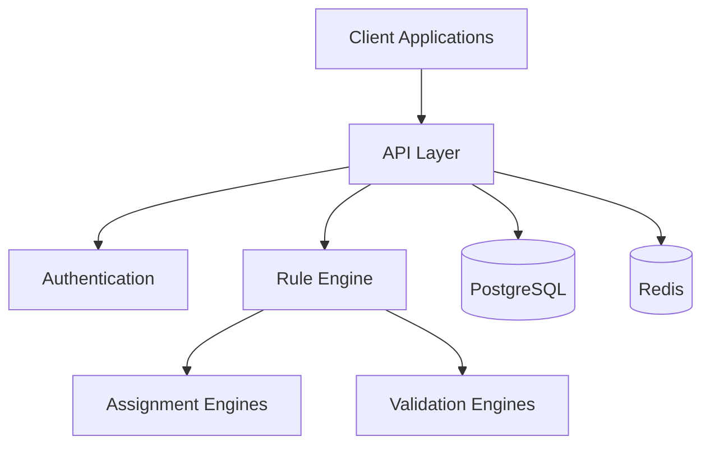

# VividShift Documentation

## Overview
VividShift is a domain-agnostic Generic Assignment Engine built with Rust that provides high-performance assignment generation through pluggable rule engines. The system automates participant-to-target assignment generation with configurable rules and strategies.

## Documentation Index

### Getting Started
- [Quick Start Guide](GETTING_STARTED.md) - Get VividShift running in 5 minutes
- [Configuration Guide](CONFIGURATION.md) - Environment and application configuration
- [API Reference](API_REFERENCE.md) - Complete API documentation

### Architecture & Development
- [System Architecture](ARCHITECTURE.md) - High-level system design and components
- [Development Guide](DEVELOPMENT.md) - Local development setup and contribution guidelines
- [Database Documentation](database/README.md) - Database design and operations

### Operations & Deployment
- [Deployment Guide](DEPLOYMENT.md) - Production deployment procedures
- [Security Guide](SECURITY.md) - Security implementation and best practices
- [Troubleshooting](TROUBLESHOOTING.md) - Common issues and solutions

### Module Documentation
- [Authentication Module](modules/authentication/README.md) - JWT authentication and authorization
- [Assignment Engines](modules/engines/README.md) - Assignment strategies and validation
- [API Layer](modules/api/README.md) - HTTP API implementation

## Quick Links
- [Health Check](http://localhost:8080/health) (when running locally)
- [API Endpoints](API_REFERENCE.md#endpoints)
- [Configuration Options](CONFIGURATION.md#environment-variables)
- [Database Schema](database/SCHEMA.md)

## System Requirements
- Docker and Docker Compose
- PostgreSQL 15+
- Redis (for caching and sessions)
- 4GB RAM minimum, 8GB recommended
- 2 CPU cores minimum

## Architecture Overview

VividShift implements a modular monolith architecture with clear separation of concerns:

## Core Features
- **Domain-Agnostic Design**: Configurable for any assignment scenario
- **Pluggable Engines**: Multiple assignment strategies and validation rules
- **High Performance**: Rust-based with async processing
- **Production Ready**: Comprehensive monitoring, logging, and security
- **Type Safety**: Compile-time guarantees with SQLx and strong typing

## Support
- **Issues**: Report bugs and feature requests on GitHub
- **Documentation**: All guides available in this docs folder
- **Examples**: See [Getting Started](GETTING_STARTED.md) for working examples
