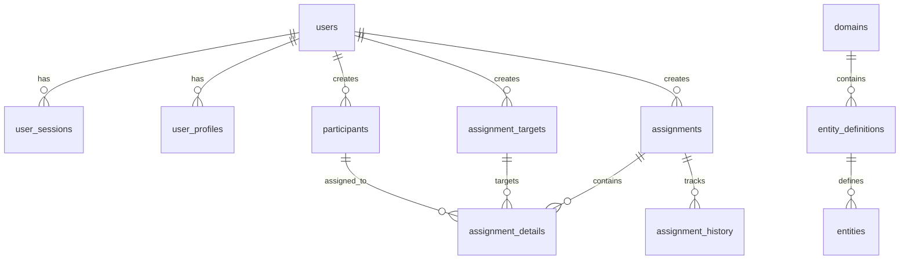

# Database Schema Design

## Overview
Comprehensive database schema documentation for VividShift's PostgreSQL implementation. This document covers table structures, relationships, indexing strategy, and design decisions.

**Target Audience:** Database developers, backend engineers, system architects

## Schema Overview



## Authentication Schema

### users
Core user authentication and profile information.

```sql
CREATE TABLE users (
    id UUID PRIMARY KEY DEFAULT uuid_generate_v4(),
    username VARCHAR(50) NOT NULL UNIQUE,
    email VARCHAR(255) NOT NULL UNIQUE,
    password_hash VARCHAR(255) NOT NULL,
    role VARCHAR(20) NOT NULL DEFAULT 'user',
    is_active BOOLEAN NOT NULL DEFAULT true,
    email_verified BOOLEAN NOT NULL DEFAULT false,
    last_login_at TIMESTAMPTZ,
    created_at TIMESTAMPTZ NOT NULL DEFAULT NOW(),
    updated_at TIMESTAMPTZ NOT NULL DEFAULT NOW()
);

-- Indexes
CREATE INDEX idx_users_username ON users(username);
CREATE INDEX idx_users_email ON users(email);
CREATE INDEX idx_users_role ON users(role);
CREATE INDEX idx_users_is_active ON users(is_active);
```

**Key Features:**
- UUID primary keys for distributed compatibility
- Unique constraints on username and email
- Role-based access control support
- Soft delete capability with `is_active`
- Automatic timestamp management

### user_sessions
JWT token management and session tracking.

```sql
CREATE TABLE user_sessions (
    id UUID PRIMARY KEY DEFAULT uuid_generate_v4(),
    user_id UUID NOT NULL REFERENCES users(id) ON DELETE CASCADE,
    token_hash VARCHAR(255) NOT NULL UNIQUE,
    expires_at TIMESTAMPTZ NOT NULL,
    user_agent TEXT,
    ip_address INET,
    is_revoked BOOLEAN NOT NULL DEFAULT false,
    created_at TIMESTAMPTZ NOT NULL DEFAULT NOW(),
    updated_at TIMESTAMPTZ NOT NULL DEFAULT NOW()
);

-- Indexes
CREATE INDEX idx_user_sessions_user_id ON user_sessions(user_id);
CREATE INDEX idx_user_sessions_token_hash ON user_sessions(token_hash);
CREATE INDEX idx_user_sessions_expires_at ON user_sessions(expires_at);
CREATE INDEX idx_user_sessions_is_revoked ON user_sessions(is_revoked);
```

**Key Features:**
- Session tracking with expiration
- IP address and user agent logging
- Token revocation support
- Automatic cleanup of expired sessions

### user_profiles
Extended user profile information.

```sql
CREATE TABLE user_profiles (
    id UUID PRIMARY KEY DEFAULT uuid_generate_v4(),
    user_id UUID NOT NULL REFERENCES users(id) ON DELETE CASCADE,
    first_name VARCHAR(100),
    last_name VARCHAR(100),
    phone VARCHAR(20),
    avatar_url TEXT,
    timezone VARCHAR(50) DEFAULT 'UTC',
    preferences JSONB DEFAULT '{}',
    metadata JSONB DEFAULT '{}',
    created_at TIMESTAMPTZ NOT NULL DEFAULT NOW(),
    updated_at TIMESTAMPTZ NOT NULL DEFAULT NOW()
);

-- Indexes
CREATE UNIQUE INDEX idx_user_profiles_user_id ON user_profiles(user_id);
CREATE INDEX idx_user_profiles_preferences_gin ON user_profiles USING gin(preferences);
CREATE INDEX idx_user_profiles_metadata_gin ON user_profiles USING gin(metadata);
```

**Key Features:**
- One-to-one relationship with users
- JSONB for flexible preferences and metadata
- Timezone support for localization
- GIN indexes for efficient JSONB queries

## Business Logic Schema

### domains
Domain configurations for different assignment contexts.

```sql
CREATE TABLE domains (
    id UUID PRIMARY KEY DEFAULT uuid_generate_v4(),
    name VARCHAR(100) NOT NULL UNIQUE,
    display_name VARCHAR(200) NOT NULL,
    description TEXT,
    version VARCHAR(20) NOT NULL DEFAULT '1.0',
    is_active BOOLEAN NOT NULL DEFAULT true,
    configuration JSONB NOT NULL DEFAULT '{}',
    business_rules JSONB DEFAULT '[]',
    created_by UUID REFERENCES users(id),
    created_at TIMESTAMPTZ NOT NULL DEFAULT NOW(),
    updated_at TIMESTAMPTZ NOT NULL DEFAULT NOW()
);

-- Indexes
CREATE INDEX idx_domains_name ON domains(name);
CREATE INDEX idx_domains_is_active ON domains(is_active);
CREATE INDEX idx_domains_configuration_gin ON domains USING gin(configuration);
CREATE INDEX idx_domains_business_rules_gin ON domains USING gin(business_rules);
```

**Key Features:**
- Domain-agnostic configuration system
- Version tracking for schema evolution
- JSONB configuration for flexibility
- Business rules storage

### participants
People who can be assigned to tasks.

```sql
CREATE TABLE participants (
    id UUID PRIMARY KEY DEFAULT uuid_generate_v4(),
    name VARCHAR(200) NOT NULL,
    email VARCHAR(255),
    phone VARCHAR(20),
    skills JSONB DEFAULT '[]',
    availability JSONB DEFAULT '{}',
    preferences JSONB DEFAULT '{}',
    metadata JSONB DEFAULT '{}',
    is_active BOOLEAN NOT NULL DEFAULT true,
    created_by UUID REFERENCES users(id),
    created_at TIMESTAMPTZ NOT NULL DEFAULT NOW(),
    updated_at TIMESTAMPTZ NOT NULL DEFAULT NOW()
);

-- Indexes
CREATE INDEX idx_participants_name ON participants(name);
CREATE INDEX idx_participants_email ON participants(email);
CREATE INDEX idx_participants_is_active ON participants(is_active);
CREATE INDEX idx_participants_skills_gin ON participants USING gin(skills);
CREATE INDEX idx_participants_availability_gin ON participants USING gin(availability);
CREATE INDEX idx_participants_preferences_gin ON participants USING gin(preferences);
CREATE INDEX idx_participants_metadata_gin ON participants USING gin(metadata);
```

**Key Features:**
- Flexible skill system with JSONB arrays
- Complex availability tracking
- Participant preferences storage
- Extensible metadata system

### assignment_targets
Tasks, work groups, etc. that need participants.

```sql
CREATE TABLE assignment_targets (
    id UUID PRIMARY KEY DEFAULT uuid_generate_v4(),
    name VARCHAR(200) NOT NULL,
    description TEXT,
    required_count INTEGER NOT NULL DEFAULT 1,
    required_skills JSONB DEFAULT '[]',
    constraints JSONB DEFAULT '{}',
    metadata JSONB DEFAULT '{}',
    is_active BOOLEAN NOT NULL DEFAULT true,
    created_by UUID REFERENCES users(id),
    created_at TIMESTAMPTZ NOT NULL DEFAULT NOW(),
    updated_at TIMESTAMPTZ NOT NULL DEFAULT NOW()
);

-- Indexes
CREATE INDEX idx_assignment_targets_name ON assignment_targets(name);
CREATE INDEX idx_assignment_targets_required_count ON assignment_targets(required_count);
CREATE INDEX idx_assignment_targets_is_active ON assignment_targets(is_active);
CREATE INDEX idx_assignment_targets_required_skills_gin ON assignment_targets USING gin(required_skills);
CREATE INDEX idx_assignment_targets_constraints_gin ON assignment_targets USING gin(constraints);
CREATE INDEX idx_assignment_targets_metadata_gin ON assignment_targets USING gin(metadata);
```

**Key Features:**
- Capacity requirements with `required_count`
- Skill requirements matching
- Flexible constraint system
- Extensible metadata

### assignments
Generated assignment results.

```sql
CREATE TABLE assignments (
    id UUID PRIMARY KEY DEFAULT uuid_generate_v4(),
    name VARCHAR(200),
    description TEXT,
    assignment_date DATE NOT NULL DEFAULT CURRENT_DATE,
    strategy_used VARCHAR(100) NOT NULL,
    configuration JSONB DEFAULT '{}',
    metadata JSONB DEFAULT '{}',
    status VARCHAR(20) NOT NULL DEFAULT 'active',
    created_by UUID REFERENCES users(id),
    created_at TIMESTAMPTZ NOT NULL DEFAULT NOW(),
    updated_at TIMESTAMPTZ NOT NULL DEFAULT NOW()
);

-- Indexes
CREATE INDEX idx_assignments_assignment_date ON assignments(assignment_date);
CREATE INDEX idx_assignments_strategy_used ON assignments(strategy_used);
CREATE INDEX idx_assignments_status ON assignments(status);
CREATE INDEX idx_assignments_created_by ON assignments(created_by);
CREATE INDEX idx_assignments_configuration_gin ON assignments USING gin(configuration);
CREATE INDEX idx_assignments_metadata_gin ON assignments USING gin(metadata);
```

**Key Features:**
- Date-based assignment tracking
- Strategy tracking for analysis
- Configuration preservation
- Status management

### assignment_details
Participant-to-target mappings.

```sql
CREATE TABLE assignment_details (
    id UUID PRIMARY KEY DEFAULT uuid_generate_v4(),
    assignment_id UUID NOT NULL REFERENCES assignments(id) ON DELETE CASCADE,
    participant_id UUID NOT NULL REFERENCES participants(id) ON DELETE CASCADE,
    target_id UUID NOT NULL REFERENCES assignment_targets(id) ON DELETE CASCADE,
    position INTEGER,
    metadata JSONB DEFAULT '{}',
    created_at TIMESTAMPTZ NOT NULL DEFAULT NOW(),
    UNIQUE(assignment_id, participant_id, target_id)
);

-- Indexes
CREATE INDEX idx_assignment_details_assignment_id ON assignment_details(assignment_id);
CREATE INDEX idx_assignment_details_participant_id ON assignment_details(participant_id);
CREATE INDEX idx_assignment_details_target_id ON assignment_details(target_id);
CREATE INDEX idx_assignment_details_position ON assignment_details(position);
CREATE INDEX idx_assignment_details_metadata_gin ON assignment_details USING gin(metadata);
```

**Key Features:**
- Many-to-many relationship resolution
- Position tracking for ordered assignments
- Unique constraint prevents duplicates
- Cascade deletes maintain integrity

### assignment_history
Complete audit trail for assignments.

```sql
CREATE TABLE assignment_history (
    id UUID PRIMARY KEY DEFAULT uuid_generate_v4(),
    assignment_id UUID NOT NULL REFERENCES assignments(id) ON DELETE CASCADE,
    action VARCHAR(50) NOT NULL,
    changes JSONB NOT NULL,
    changed_by UUID REFERENCES users(id),
    changed_at TIMESTAMPTZ NOT NULL DEFAULT NOW(),
    metadata JSONB DEFAULT '{}'
);

-- Indexes
CREATE INDEX idx_assignment_history_assignment_id ON assignment_history(assignment_id);
CREATE INDEX idx_assignment_history_action ON assignment_history(action);
CREATE INDEX idx_assignment_history_changed_by ON assignment_history(changed_by);
CREATE INDEX idx_assignment_history_changed_at ON assignment_history(changed_at);
CREATE INDEX idx_assignment_history_changes_gin ON assignment_history USING gin(changes);
```

**Key Features:**
- Complete change tracking
- User attribution for all changes
- JSONB change storage
- Timestamp-based audit trail

## Indexing Strategy

### B-tree Indexes
Standard indexes for equality and range queries:

```sql
-- Authentication performance
CREATE INDEX idx_users_username ON users(username);
CREATE INDEX idx_users_email ON users(email);
CREATE INDEX idx_user_sessions_token_hash ON user_sessions(token_hash);

-- Business logic performance
CREATE INDEX idx_participants_name ON participants(name);
CREATE INDEX idx_assignments_assignment_date ON assignments(assignment_date);
CREATE INDEX idx_assignment_details_assignment_id ON assignment_details(assignment_id);
```

### GIN Indexes for JSONB
Optimized indexes for JSONB operations:

```sql
-- Skill-based queries
CREATE INDEX idx_participants_skills_gin ON participants USING gin(skills);
CREATE INDEX idx_assignment_targets_required_skills_gin ON assignment_targets USING gin(required_skills);

-- Metadata searches
CREATE INDEX idx_participants_metadata_gin ON participants USING gin(metadata);
CREATE INDEX idx_assignments_configuration_gin ON assignments USING gin(configuration);
```

### Composite Indexes
Multi-column indexes for complex queries:

```sql
-- Assignment lookup optimization
CREATE INDEX idx_assignment_details_composite ON assignment_details(assignment_id, participant_id);

-- Date-based queries with status
CREATE INDEX idx_assignments_date_status ON assignments(assignment_date, status);

-- Active participants with skills
CREATE INDEX idx_participants_active_skills ON participants(is_active) WHERE is_active = true;
```

## Query Patterns

### High-Performance Queries

#### Skill-Based Participant Search
```sql
-- Find participants with specific skills
SELECT * FROM participants 
WHERE is_active = true 
  AND skills ? 'cleaning'
  AND skills ? 'organizing';

-- Performance: Uses GIN index on skills column
```

#### Assignment History Lookup
```sql
-- Get assignment details with participant/target info
SELECT 
    ad.id,
    p.name as participant_name,
    at.name as target_name,
    ad.position,
    ad.metadata
FROM assignment_details ad
JOIN participants p ON ad.participant_id = p.id
JOIN assignment_targets at ON ad.target_id = at.id
WHERE ad.assignment_id = $1
ORDER BY ad.position;

-- Performance: Uses composite index on assignment_details
```

#### Date Range Assignments
```sql
-- Find assignments within date range
SELECT * FROM assignments 
WHERE assignment_date BETWEEN $1 AND $2
  AND status = 'active'
ORDER BY assignment_date DESC;

-- Performance: Uses composite index on (assignment_date, status)
```

### Complex JSONB Queries

#### Availability Matching
```sql
-- Find available participants for specific time
SELECT * FROM participants 
WHERE is_active = true
  AND availability @> '{"monday": {"9:00": "available"}}'::jsonb;

-- Performance: Uses GIN index on availability column
```

#### Skill Requirements Matching
```sql
-- Match participants to targets by skills
SELECT 
    p.name as participant,
    at.name as target,
    p.skills,
    at.required_skills
FROM participants p
CROSS JOIN assignment_targets at
WHERE p.is_active = true
  AND at.is_active = true
  AND p.skills @> at.required_skills;

-- Performance: Uses GIN indexes on both skills columns
```

## Data Types and Constraints

### UUID Usage
All primary keys use UUID v4 for distributed system compatibility:

```sql
-- UUID generation
id UUID PRIMARY KEY DEFAULT uuid_generate_v4()

-- Benefits:
-- - Globally unique across systems
-- - No coordination needed for ID generation
-- - Suitable for distributed architectures
-- - Prevents ID enumeration attacks
```

### JSONB Schema Design

#### Skills Array
```sql
-- Participant skills
skills JSONB DEFAULT '[]'

-- Example data:
-- ["cleaning", "organizing", "leadership", "communication"]

-- Query patterns:
-- skills ? 'cleaning'                    -- Has skill
-- skills @> '["cleaning", "organizing"]' -- Has all skills
-- jsonb_array_length(skills) > 2        -- Skill count
```

#### Availability Object
```sql
-- Participant availability
availability JSONB DEFAULT '{}'

-- Example data:
{
  "monday": {"9:00": "available", "17:00": "unavailable"},
  "tuesday": {"9:00": "available", "17:00": "available"},
  "preferences": {"morning_shift": true}
}

-- Query patterns:
-- availability -> 'monday' -> '9:00' = '"available"'
-- availability @> '{"preferences": {"morning_shift": true}}'
```

#### Configuration Storage
```sql
-- Assignment configuration
configuration JSONB DEFAULT '{}'

-- Example data:
{
  "strategy_parameters": {
    "rotation_weight": 0.8,
    "balance_weight": 0.2
  },
  "constraints": {
    "max_assignments_per_participant": 3
  },
  "validation_rules": ["capacity_check", "skill_matching"]
}
```

### Constraints and Validation

#### Check Constraints
```sql
-- Ensure valid roles
ALTER TABLE users ADD CONSTRAINT check_user_role 
CHECK (role IN ('admin', 'user', 'viewer'));

-- Ensure positive required count
ALTER TABLE assignment_targets ADD CONSTRAINT check_required_count 
CHECK (required_count > 0);

-- Ensure valid status values
ALTER TABLE assignments ADD CONSTRAINT check_assignment_status 
CHECK (status IN ('active', 'completed', 'cancelled'));
```

#### Foreign Key Constraints
```sql
-- Cascade deletes for dependent data
REFERENCES users(id) ON DELETE CASCADE

-- Restrict deletes for referenced data
REFERENCES participants(id) ON DELETE RESTRICT

-- Set null for optional references
REFERENCES users(id) ON DELETE SET NULL
```

## Triggers and Automation

### Automatic Timestamp Updates
```sql
-- Function to update timestamps
CREATE OR REPLACE FUNCTION update_updated_at_column()
RETURNS TRIGGER AS $$
BEGIN
    NEW.updated_at = NOW();
    RETURN NEW;
END;
$$ language 'plpgsql';

-- Apply to all tables with updated_at
CREATE TRIGGER update_users_updated_at 
    BEFORE UPDATE ON users 
    FOR EACH ROW EXECUTE FUNCTION update_updated_at_column();
```

### Audit Trail Triggers
```sql
-- Automatic assignment history tracking
CREATE OR REPLACE FUNCTION track_assignment_changes()
RETURNS TRIGGER AS $$
BEGIN
    INSERT INTO assignment_history (
        assignment_id, 
        action, 
        changes, 
        changed_by
    ) VALUES (
        COALESCE(NEW.id, OLD.id),
        TG_OP,
        to_jsonb(NEW) - to_jsonb(OLD),
        current_setting('app.current_user_id', true)::uuid
    );
    RETURN COALESCE(NEW, OLD);
END;
$$ language 'plpgsql';

CREATE TRIGGER assignment_audit_trigger
    AFTER INSERT OR UPDATE OR DELETE ON assignments
    FOR EACH ROW EXECUTE FUNCTION track_assignment_changes();
```

## Performance Optimization

### Connection Pool Configuration
```sql
-- Recommended PostgreSQL settings
max_connections = 100
shared_buffers = 256MB
effective_cache_size = 1GB
work_mem = 4MB
maintenance_work_mem = 64MB
```

### Query Performance Monitoring
```sql
-- Enable query statistics
CREATE EXTENSION IF NOT EXISTS pg_stat_statements;

-- Monitor slow queries
SELECT 
    query,
    calls,
    total_time,
    mean_time,
    stddev_time
FROM pg_stat_statements
WHERE mean_time > 100  -- queries slower than 100ms
ORDER BY mean_time DESC;
```

### Index Usage Analysis
```sql
-- Check index usage statistics
SELECT 
    schemaname,
    tablename,
    indexname,
    idx_scan,
    idx_tup_read,
    idx_tup_fetch
FROM pg_stat_user_indexes
ORDER BY idx_scan DESC;

-- Find unused indexes
SELECT 
    schemaname,
    tablename,
    indexname
FROM pg_stat_user_indexes
WHERE idx_scan = 0
  AND schemaname = 'public';
```

## Schema Migration Strategy

### Version Control
- All schema changes tracked in migration files
- Timestamped migration naming: `YYYYMMDD_HHMMSS_description.sql`
- Rollback scripts for all migrations: `*.down.sql`

### Migration Best Practices
1. **Backward Compatibility**: New columns nullable initially
2. **Index Creation**: Use `CONCURRENTLY` for large tables
3. **Data Migration**: Separate data changes from schema changes
4. **Testing**: Validate migrations on production-like data
5. **Rollback Planning**: Always provide rollback procedures

## References
- [Database Operations](OPERATIONS.md) - Maintenance procedures
- [Migration Guide](MIGRATIONS.md) - Schema versioning
- [Configuration Reference](../CONFIGURATION.md) - Database configuration
- [API Integration](../API_REFERENCE.md) - Database usage in API
